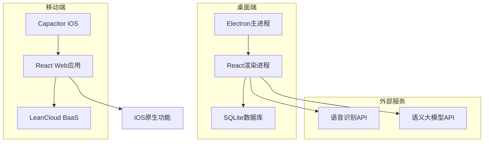
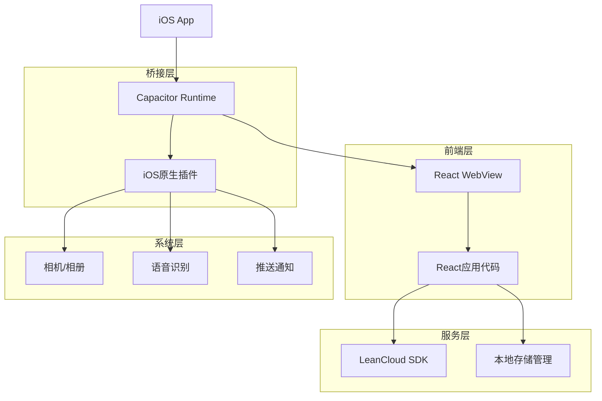
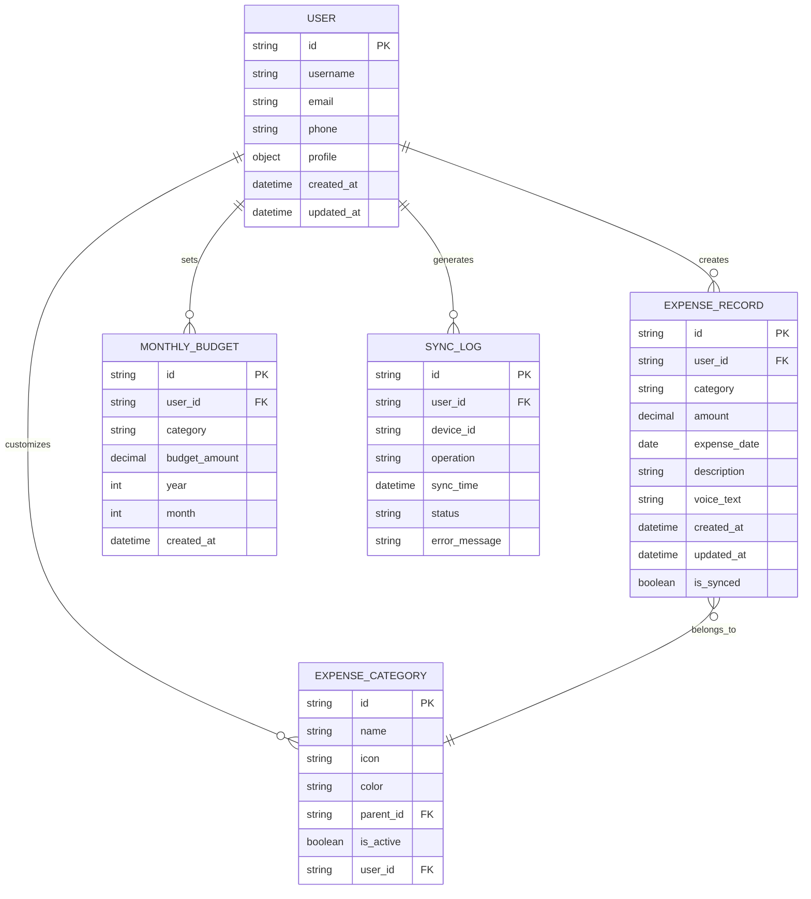
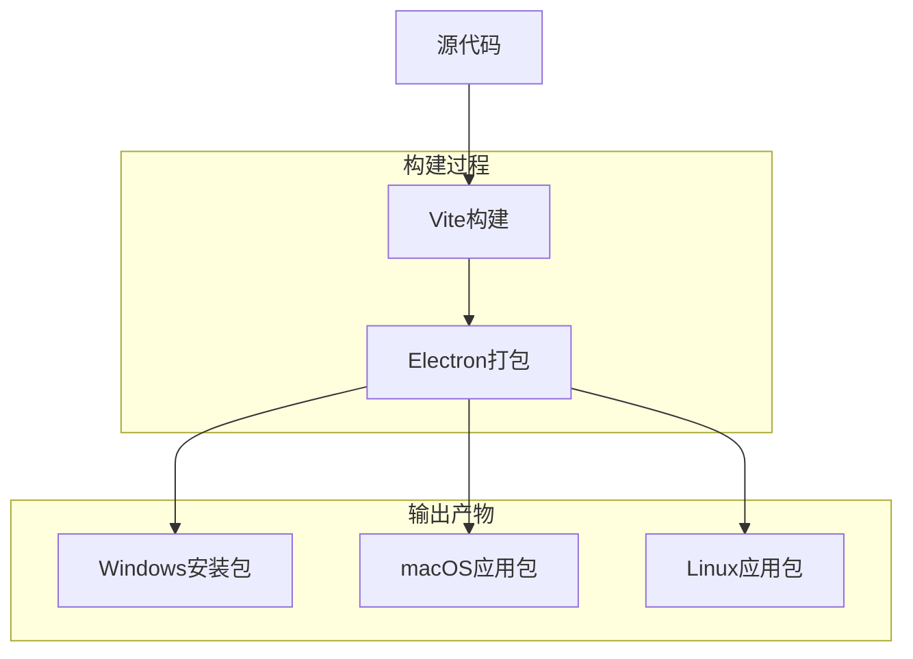
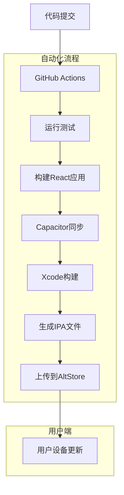

## 1. 架构设计

### 1.1 整体架构


### 1.2 iOS架构详图


## 2. 技术描述

### 2.1 桌面端（Windows）
- **桌面框架**: Electron@27 + React@18 + TypeScript@5
- **UI框架**: Tailwind CSS@3 + Headless UI
- **数据库**: SQLite3 + better-sqlite3驱动
- **构建工具**: Vite@5 + electron-vite
- **语音识别**: Web Speech API / Azure Speech Service
- **语义理解**: OpenAI GPT API / 文心一言API
- **图表库**: Chart.js@4 + react-chartjs-2
- **状态管理**: Zustand@4
- **日期处理**: date-fns@2

### 2.2 移动端（iOS）
- **跨平台框架**: Capacitor@5 + React@18 + TypeScript@5
- **后端服务**: LeanCloud BaaS（用户认证、数据存储、实时同步）
- **本地存储**: Capacitor Storage API + IndexedDB
- **语音识别**: iOS原生Speech Framework（通过Capacitor插件）
- **推送通知**: 应用内消息 + 邮件通知（替代APNs）
- **构建工具**: Vite@5 + Xcode Cloud（通过GitHub Actions）
- **分发方式**: AltStore侧载（免证书分发）
- **状态管理**: Zustand@4 + 离线缓存策略

### 2.3 跨平台共享
- **核心代码**: React组件和逻辑代码完全共享
- **数据模型**: 统一的数据结构和接口定义
- **业务逻辑**: 通过条件编译适配不同平台特性
- **UI组件**: 响应式设计适配不同屏幕尺寸

## 3. 路由定义

### 3.1 桌面端路由
| 路由 | 用途 |
|------|------|
| / | 主界面，包含导航和功能入口 |
| /voice | 语音记账页面，核心功能页面 |
| /statistics | 账单统计页面，数据可视化 |
| /history | 历史记录页面，记录管理 |
| /settings | 设置页面，应用配置 |

### 3.2 移动端路由
| 路由 | 用途 |
|------|------|
| /login | 登录注册页面，用户认证入口 |
| /tabs/home | 主界面，底部标签导航 |
| /tabs/voice | 语音记账页面，核心功能 |
| /tabs/statistics | 账单统计页面，数据可视化 |
| /tabs/history | 历史记录页面，记录管理 |
| /tabs/profile | 用户中心页面，个人资料 |
| /sync | 数据同步页面，显示同步状态 |

## 4. 数据模型

### 4.1 统一数据模型


### 4.2 SQLite数据库定义（桌面端）

**记账记录表 (expense_records)**
```sql
-- 创建记账记录表
CREATE TABLE expense_records (
    id INTEGER PRIMARY KEY AUTOINCREMENT,
    category VARCHAR(50) NOT NULL,
    amount DECIMAL(10, 2) NOT NULL,
    expense_date DATE NOT NULL,
    description TEXT,
    voice_text TEXT,
    created_at DATETIME DEFAULT CURRENT_TIMESTAMP,
    updated_at DATETIME DEFAULT CURRENT_TIMESTAMP
);

-- 创建索引
CREATE INDEX idx_expense_date ON expense_records(expense_date);
CREATE INDEX idx_category ON expense_records(category);
CREATE INDEX idx_created_at ON expense_records(created_at DESC);
```

**支出分类表 (expense_categories)**
```sql
-- 创建支出分类表
CREATE TABLE expense_categories (
    id INTEGER PRIMARY KEY AUTOINCREMENT,
    name VARCHAR(50) NOT NULL UNIQUE,
    icon VARCHAR(50),
    color VARCHAR(7) DEFAULT '#10B981',
    parent_id INTEGER,
    is_active BOOLEAN DEFAULT 1,
    created_at DATETIME DEFAULT CURRENT_TIMESTAMP,
    FOREIGN KEY (parent_id) REFERENCES expense_categories(id)
);

-- 插入默认分类
INSERT INTO expense_categories (name, icon, color) VALUES 
('餐饮', '🍽️', '#EF4444'),
('交通', '🚗', '#3B82F6'),
('购物', '🛍️', '#8B5CF6'),
('娱乐', '🎬', '#F59E0B'),
('医疗', '🏥', '#10B981'),
('教育', '📚', '#6366F1'),
('住房', '🏠', '#EC4899'),
('其他', '📦', '#6B7280');
```

### 4.3 LeanCloud数据定义（移动端）

**用户表 (_User)**
```javascript
// LeanCloud用户表自动创建，扩展字段包括：
{
  "username": "string",           // 用户名
  "email": "string",              // 邮箱
  "mobilePhoneNumber": "string",  // 手机号
  "profile": {
    "nickname": "string",         // 昵称
    "avatar": "string",           // 头像URL
    "preferences": "object"       // 用户偏好设置
  },
  "subscription": {
    "type": "string",             // 订阅类型: free/premium
    "expiresAt": "date"           // 到期时间
  }
}
```

**记账记录表 (ExpenseRecord)**
```javascript
// LeanCloud class定义
AV.Object.extend('ExpenseRecord', {
  user: AV.User,                    // 关联用户
  category: String,                // 消费分类
  amount: Number,                  // 消费金额
  expenseDate: Date,               // 消费日期
  description: String,           // 消费描述
  voiceText: String,               // 原始语音文本
  isSynced: Boolean,               // 同步状态
  deviceId: String,                // 设备ID
  localId: String                  // 本地ID，用于冲突解决
});
```

**同步日志表 (SyncLog)**
```javascript
// LeanCloud class定义
AV.Object.extend('SyncLog', {
  user: AV.User,                   // 关联用户
  deviceId: String,                // 设备ID
  operation: String,               // 操作类型: create/update/delete
  entityType: String,              // 实体类型
  entityId: String,                // 实体ID
  syncTime: Date,                  // 同步时间
  status: String,                  // 状态: success/failed
  errorMessage: String            // 错误信息
});
```

## 5. API接口定义

### 5.1 桌面端API（本地SQLite）

**添加记账记录**
```
POST /api/expenses
```

请求参数：
| 参数名 | 类型 | 必填 | 描述 |
|--------|------|------|------|
| category | string | 是 | 消费分类 |
| amount | number | 是 | 消费金额 |
| expense_date | string | 是 | 消费日期 (YYYY-MM-DD) |
| description | string | 否 | 消费描述 |
| voice_text | string | 否 | 原始语音文本 |

响应示例：
```json
{
  "id": 1,
  "category": "餐饮",
  "amount": 35.50,
  "expense_date": "2024-01-15",
  "description": "午餐",
  "created_at": "2024-01-15 12:30:00"
}
```

### 5.2 移动端API（LeanCloud）

**用户注册**
```
POST /api/users/register
```

请求参数：
| 参数名 | 类型 | 必填 | 描述 |
|--------|------|------|------|
| username | string | 是 | 用户名 |
| email | string | 是 | 邮箱地址 |
| password | string | 是 | 密码 |
| phone | string | 否 | 手机号 |

**用户登录**
```
POST /api/users/login
```

请求参数：
| 参数名 | 类型 | 必填 | 描述 |
|--------|------|------|------|
| username | string | 是 | 用户名或邮箱 |
| password | string | 是 | 密码 |

**数据同步**
```
POST /api/sync
```

请求参数：
| 参数名 | 类型 | 必填 | 描述 |
|--------|------|------|------|
| lastSyncTime | string | 是 | 上次同步时间 |
| deviceId | string | 是 | 设备ID |
| changes | array | 是 | 变更数据列表 |

### 5.3 跨平台共享API

**语音识别**
```
POST /api/speech-to-text
```

请求参数：
| 参数名 | 类型 | 必填 | 描述 |
|--------|------|------|------|
| audio_blob | blob | 是 | 音频数据 |
| language | string | 否 | 语言代码 (默认: zh-CN) |

**语义解析**
```
POST /api/parse-expense
```

请求参数：
| 参数名 | 类型 | 必填 | 描述 |
|--------|------|------|------|
| text | string | 是 | 待解析文本 |

响应示例：
```json
{
  "category": "餐饮",
  "amount": 45.80,
  "expense_date": "2024-01-15",
  "description": "中午在公司附近吃面条",
  "confidence": 0.95,
  "missing_fields": []
}
```

## 6. 构建和部署架构

### 6.1 桌面端构建流程


### 6.2 移动端CI/CD流程


### 6.3 环境配置

**GitHub Actions工作流配置**
```yaml
name: iOS Build and Deploy

on:
  push:
    branches: [ main ]
  workflow_dispatch:

jobs:
  build:
    runs-on: macos-latest
    
    steps:
    - uses: actions/checkout@v3
    
    - name: Setup Node.js
      uses: actions/setup-node@v3
      with:
        node-version: '18'
    
    - name: Install dependencies
      run: |
        npm install
        npm install -g @capacitor/cli
    
    - name: Build React app
      run: npm run build
    
    - name: Sync Capacitor
      run: |
        npx cap sync ios
        npx cap update ios
    
    - name: Build iOS
      run: |
        cd ios/App
        xcodebuild -workspace App.xcworkspace \
          -scheme App \
          -configuration Release \
          -archivePath App.xcarchive \
          archive
    
    - name: Export IPA
      run: |
        xcodebuild -exportArchive \
          -archivePath App.xcarchive \
          -exportPath build \
          -exportOptionsPlist exportOptions.plist
    
    - name: Upload to AltStore
      env:
        ALTSTORE_URL: ${{ secrets.ALTSTORE_URL }}
        ALTSTORE_API_KEY: ${{ secrets.ALTSTORE_API_KEY }}
      run: |
        curl -X POST "$ALTSTORE_URL" \
          -F "file=@build/App.ipa" \
          -F "version=${{ github.run_number }}"
```

## 7. 数据同步策略

### 7.1 同步机制
```javascript
class SyncManager {
  async syncData() {
    const lastSyncTime = await this.getLastSyncTime();
    const localChanges = await this.getLocalChanges(lastSyncTime);
    const serverChanges = await this.fetchServerChanges(lastSyncTime);
    
    // 处理冲突
    const resolvedChanges = this.resolveConflicts(localChanges, serverChanges);
    
    // 应用变更
    await this.applyChanges(resolvedChanges);
    
    // 更新同步时间
    await this.updateLastSyncTime();
  }
  
  resolveConflicts(local, server) {
    // 采用最后写入获胜策略
    return conflicts.map(conflict => {
      if (local.updatedAt > server.updatedAt) {
        return local;
      } else {
        return server;
      }
    });
  }
}
```

### 7.2 离线缓存策略
```javascript
class OfflineManager {
  async cacheData(data) {
    // 存储到IndexedDB
    await db.table('expense_records').put(data);
    
    // 标记为待同步
    await db.table('sync_queue').put({
      operation: 'create',
      entity: 'expense_record',
      data: data,
      timestamp: new Date()
    });
  }
  
  async getCachedData() {
    return await db.table('expense_records').toArray();
  }
}
```

## 8. 安全策略

### 8.1 数据安全
- **传输加密**: 所有API通信使用HTTPS/TLS加密
- **本地加密**: 敏感数据使用AES加密存储
- **认证安全**: 使用JWT令牌进行身份验证
- **权限控制**: 基于角色的访问控制（RBAC）

### 8.2 隐私保护
- **数据本地化**: 用户数据优先存储在本地
- **最小权限**: 只申请必要的系统权限
- **数据匿名化**: 分析数据时进行匿名化处理
- **用户控制**: 用户可完全控制自己的数据

## 9. 性能优化

### 9.1 移动端优化
- **代码分割**: 按需加载，减少初始包大小
- **图片优化**: 使用WebP格式，支持懒加载
- **缓存策略**: 智能缓存，减少网络请求
- **原生优化**: 利用iOS原生性能优势

### 9.2 同步优化
- **增量同步**: 只同步变更的数据
- **压缩传输**: 数据压缩，减少传输量
- **批量操作**: 合并多个操作，减少请求次数
- **冲突解决**: 客户端冲突解决，减少服务器压力