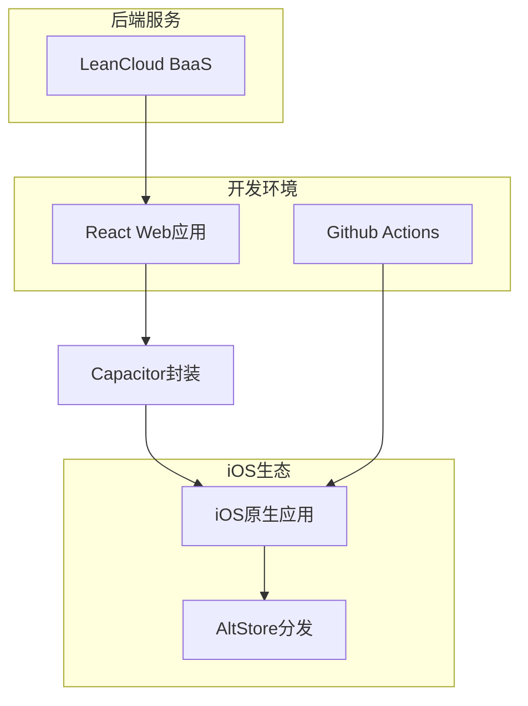

# React Web应用iOS迁移完整指南

## 概述
本指南详细介绍了如何将现有React Web应用封装为iOS APP，实现无需MAC开发环境、免苹果开发者账号的可持续迭代发布流程。

## 1. 应用封装架构

### 1.1 技术栈选择
- **前端框架**: 保持现有React Web应用代码库
- **跨平台封装**: Capacitor v5+ 进行Web到原生封装
- **构建工具链**: Github Actions + 远程Mac runner

### 1.2 架构设计


## 2. 用户系统实现

### 2.1 LeanCloud集成方案

#### 认证服务配置
```javascript
// LeanCloud初始化
import AV from 'leancloud-storage';

AV.init({
  appId: 'your-app-id',
  appKey: 'your-app-key',
  serverURL: 'https://your-server-url.lc-cn-n1-shared.com'
});

// 用户注册
const user = new AV.User();
user.setUsername(email);
user.setPassword(password);
user.setEmail(email);
user.setMobilePhoneNumber(phone);

// 第三方登录集成
AV.User.loginWithAuthData(authData, platform);
```

#### 数据模型设计
```json
{
  "user": {
    "objectId": "string",
    "username": "string",
    "email": "string",
    "phone": "string",
    "profile": {
      "nickname": "string",
      "avatar": "string",
      "preferences": "object"
    },
    "createdAt": "datetime",
    "updatedAt": "datetime"
  },
  "userData": {
    "objectId": "string",
    "userId": "string",
    "data": "object",
    "syncStatus": "string",
    "lastSyncTime": "datetime"
  }
}
```

### 2.2 离线优先策略
```javascript
// 本地存储管理
class OfflineManager {
  async syncData() {
    const localData = await this.getLocalData();
    const serverData = await this.fetchServerData();
    
    // 冲突解决策略
    return this.resolveConflict(localData, serverData);
  }
  
  async cacheData(data) {
    localStorage.setItem('app_data', JSON.stringify(data));
  }
}
```

## 3. 免证书分发方案

### 3.1 AltStore配置

#### Bundle Identifier配置
```xml
<!-- Info.plist -->
<key>CFBundleIdentifier</key>
<string>com.yourcompany.yourapp</string>
<key>CFBundleShortVersionString</key>
<string>1.0.0</string>
<key>CFBundleVersion</key>
<string>1</string>
<key>MinimumOSVersion</key>
<string>14.0</string>
```

#### 自动续签机制
```bash
# AltStore续签脚本
#!/bin/bash
# 每周自动续签
0 2 * * 1 /usr/local/bin/altstore-refresh.sh
```

### 3.2 OTA更新通道
```javascript
// 版本检查
class UpdateManager {
  async checkForUpdates() {
    const currentVersion = await this.getCurrentVersion();
    const latestVersion = await this.fetchLatestVersion();
    
    if (this.isUpdateAvailable(currentVersion, latestVersion)) {
      this.promptUpdate(latestVersion);
    }
  }
  
  async downloadUpdate() {
    const updateUrl = await this.getUpdateUrl();
    return this.downloadFile(updateUrl);
  }
}
```

## 4. 持续迭代方案

### 4.1 Github Actions工作流
```yaml
# .github/workflows/ios-build.yml
name: iOS Build and Deploy

on:
  push:
    branches: [ main ]
  workflow_dispatch:

jobs:
  build:
    runs-on: macos-latest
    
    steps:
    - uses: actions/checkout@v3
    
    - name: Setup Node.js
      uses: actions/setup-node@v3
      with:
        node-version: '18'
    
    - name: Install dependencies
      run: |
        npm install
        npm install -g @capacitor/cli
    
    - name: Build React app
      run: npm run build
    
    - name: Sync Capacitor
      run: |
        npx cap sync ios
        npx cap update ios
    
    - name: Build iOS
      run: |
        cd ios
        xcodebuild -workspace App.xcworkspace \
          -scheme App \
          -configuration Release \
          -archivePath App.xcarchive \
          archive
    
    - name: Export IPA
      run: |
        xcodebuild -exportArchive \
          -archivePath App.xcarchive \
          -exportPath build \
          -exportOptionsPlist exportOptions.plist
    
    - name: Upload to AltStore
      run: |
        # 上传到AltStore服务器
        curl -X POST "${{ secrets.ALTSTORE_URL }}" \
          -F "file=@build/App.ipa" \
          -F "version=${{ github.run_number }}"
```

### 4.2 版本管理策略
```javascript
// 语义化版本控制
const semver = require('semver');

class VersionManager {
  bumpVersion(currentVersion, releaseType) {
    return semver.inc(currentVersion, releaseType);
  }
  
  createReleaseNotes(version, commits) {
    return {
      version,
      date: new Date(),
      changes: this.parseCommits(commits)
    };
  }
}
```

## 5. 新手适配指南

### 5.1 环境初始化

#### Capacitor iOS环境配置
```bash
# 安装Capacitor
npm install @capacitor/core @capacitor/ios
npm install -g @capacitor/cli

# 初始化Capacitor
npx cap init "YourAppName" "com.yourcompany.yourapp"

# 添加iOS平台
npx cap add ios

# 配置iOS项目
cd ios/App
pod install
```

#### LeanCloud服务注册
1. 访问 [LeanCloud控制台](https://console.leancloud.app)
2. 创建新应用
3. 获取App ID和App Key
4. 配置数据存储权限
5. 设置用户认证选项

### 5.2 API密钥管理
```javascript
// 环境变量配置
// .env
REACT_APP_LEANCLOUD_APP_ID=your-app-id
REACT_APP_LEANCLOUD_APP_KEY=your-app-key
REACT_APP_LEANCLOUD_SERVER_URL=your-server-url

// config.js
const config = {
  leancloud: {
    appId: process.env.REACT_APP_LEANCLOUD_APP_ID,
    appKey: process.env.REACT_APP_LEANCLOUD_APP_KEY,
    serverURL: process.env.REACT_APP_LEANCLOUD_SERVER_URL
  },
  altstore: {
    url: process.env.REACT_APP_ALTSTORE_URL,
    apiKey: process.env.REACT_APP_ALTSTORE_API_KEY
  }
};
```

### 5.3 调试检查清单

#### 开发环境检查
- [ ] Node.js版本 >= 16
- [ ] Capacitor CLI已安装
- [ ] iOS模拟器或真机连接正常
- [ ] LeanCloud服务可访问

#### 构建过程检查
- [ ] React构建成功
- [ ] Capacitor同步完成
- [ ] Xcode项目配置正确
- [ ] Bundle Identifier唯一
- [ ] 版本号正确设置

#### 分发验证检查
- [ ] IPA文件生成成功
- [ ] AltStore上传完成
- [ ] 安装测试通过
- [ ] 更新机制正常工作

## 6. 质量保障措施

### 6.1 端到端测试
```javascript
// Cypress测试用例
describe('用户注册登录流程', () => {
  it('应该能成功注册用户', () => {
    cy.visit('/register');
    cy.get('#email').type('test@example.com');
    cy.get('#password').type('password123');
    cy.get('#register-btn').click();
    cy.contains('注册成功').should('be.visible');
  });
  
  it('应该能成功登录', () => {
    cy.visit('/login');
    cy.get('#email').type('test@example.com');
    cy.get('#password').type('password123');
    cy.get('#login-btn').click();
    cy.url().should('include', '/dashboard');
  });
});
```

### 6.2 监控方案
```javascript
// 错误日志收集
class ErrorMonitor {
  init() {
    window.addEventListener('error', (event) => {
      this.logError({
        message: event.message,
        filename: event.filename,
        lineno: event.lineno,
        colno: event.colno,
        stack: event.error?.stack
      });
    });
    
    window.addEventListener('unhandledrejection', (event) => {
      this.logError({
        type: 'unhandledrejection',
        reason: event.reason
      });
    });
  }
  
  async logError(error) {
    // 发送到监控服务
    await fetch('/api/errors', {
      method: 'POST',
      body: JSON.stringify(error)
    });
  }
}

// 性能监控
class PerformanceMonitor {
  init() {
    if ('performance' in window) {
      window.addEventListener('load', () => {
        const perfData = performance.getEntriesByType('navigation')[0];
        this.reportMetrics({
          loadTime: perfData.loadEventEnd - perfData.loadEventStart,
          domContentLoaded: perfData.domContentLoadedEventEnd - perfData.domContentLoadedEventStart,
          firstPaint: this.getFirstPaint()
        });
      });
    }
  }
}
```

## 7. 替代方案实现

### 7.1 推送通知替代方案
由于无法使用APNs，采用以下替代方案：

1. **应用内消息系统**
```javascript
// 轮询检查新消息
class MessageService {
  async checkMessages() {
    const messages = await this.fetchMessages();
    if (messages.length > 0) {
      this.showLocalNotification(messages[0]);
    }
  }
  
  showLocalNotification(message) {
    if ('Notification' in window) {
      new Notification('新消息', {
        body: message.content,
        icon: '/icon-192x192.png'
      });
    }
  }
}
```

2. **邮件通知**
通过LeanCloud的云函数发送邮件通知：
```javascript
// 云函数
AV.Cloud.define('sendEmailNotification', async (request) => {
  const { email, subject, content } = request.params;
  
  await AV.Cloud.sendEmail({
    to: email,
    subject: subject,
    html: content
  });
  
  return { success: true };
});
```

### 7.2 Web版备用访问
保留Web版本作为备用访问渠道：

```javascript
// 环境检测
const isNative = Capacitor.isNativePlatform();

if (!isNative) {
  // Web环境，启用完整功能
  enableWebFeatures();
} else {
  // iOS原生环境，启用原生功能
  enableNativeFeatures();
}
```

## 8. 部署清单

### 8.1 生产环境部署
- [ ] 配置生产环境LeanCloud应用
- [ ] 设置生产环境API密钥
- [ ] 配置Github Actions密钥
- [ ] 部署AltStore服务器
- [ ] 配置域名和HTTPS证书
- [ ] 设置监控和告警

### 8.2 发布流程
1. 代码合并到main分支
2. 自动触发Github Actions构建
3. 等待构建完成
4. 验证IPA文件
5. 上传到AltStore
6. 通知用户更新

## 9. 故障排除

### 9.1 常见问题

#### Capacitor构建失败
- 检查Xcode版本兼容性
- 验证pod依赖安装
- 清理构建缓存

#### AltStore安装失败
- 检查Bundle Identifier格式
- 验证AltStore服务器配置
- 确认设备信任设置

#### 数据同步异常
- 检查LeanCloud网络连接
- 验证数据权限配置
- 查看离线缓存状态

### 9.2 支持资源
- [Capacitor官方文档](https://capacitorjs.com/docs)
- [LeanCloud开发指南](https://leancloud.cn/docs)
- [AltStore文档](https://altstore.io)
- [Github Actions文档](https://docs.github.com/actions)

## 总结

本方案提供了一套完整的React Web应用到iOS原生应用的迁移解决方案，通过Capacitor实现跨平台封装，利用LeanCloud提供后端服务，采用AltStore实现免证书分发，配合Github Actions实现自动化构建和发布。整个流程无需MAC开发环境和苹果开发者账号，适合个人开发者和小团队使用。