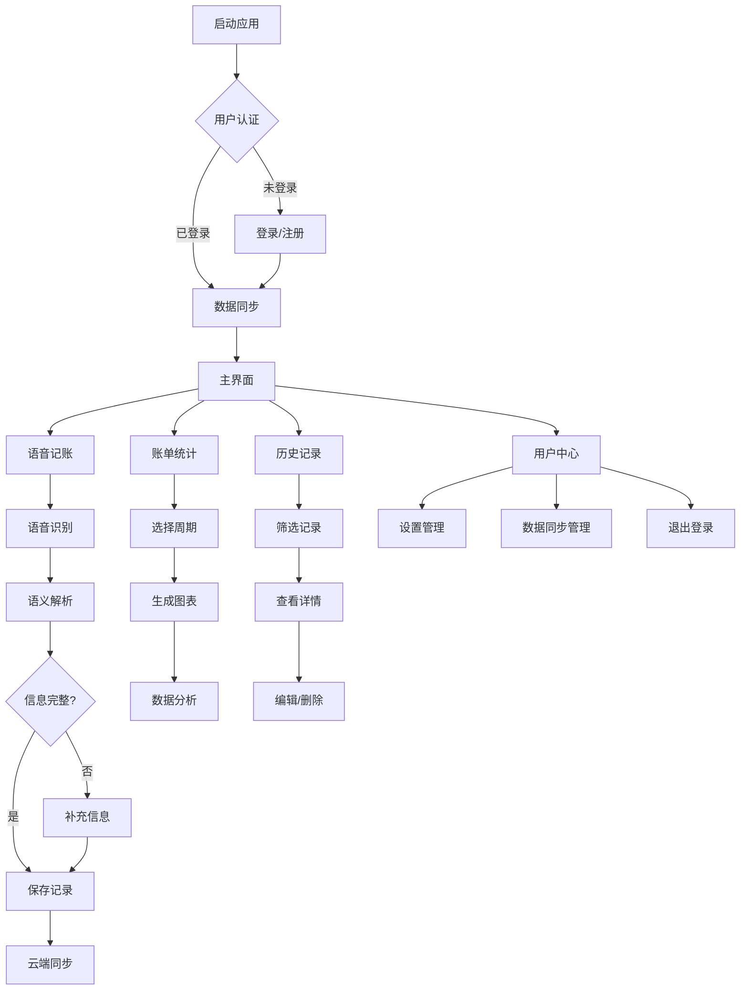

## 1. 产品概述

语音记账助手是一款跨平台智能记账应用，支持Windows桌面端和iOS移动端。通过语音输入实现智能记账功能，用户只需说出消费内容，系统即可自动识别消费类别、金额、日期，并生成完整的记账记录。

解决传统记账应用输入繁琐的问题，为个人和小微企业用户提供高效、智能的财务管理工具，帮助用户轻松掌握收支情况。支持数据跨设备同步，确保用户在不同平台上都能获得一致的记账体验。

## 2. 核心功能

### 2.1 用户角色

| 角色 | 注册方式 | 核心权限 |
|------|----------|----------|
| 普通用户 | 邮箱/手机号注册 | 基础记账、数据统计、历史记录查看 |
| 高级用户 | 内购升级 | 数据导出、高级图表、预算提醒、云同步 |

### 2.2 功能模块

语音记账助手包含以下核心页面：

1. **语音记账页面**：语音输入、实时识别、信息确认、补充输入。
2. **账单统计页面**：图表展示、周期选择、同比环比分析。
3. **历史记录页面**：账单列表、详情查看、编辑删除。
4. **用户中心页面**：个人资料、数据同步、设置管理。
5. **登录注册页面**：用户认证、第三方登录、密码找回。

### 2.3 页面详情

| 页面名称 | 模块名称 | 功能描述 |
|----------|----------|----------|
| 语音记账页面 | 语音识别模块 | 点击录音按钮开始语音识别，实时显示识别文本，支持中文语音输入，iOS端支持原生语音识别 |
| 语音记账页面 | 智能解析模块 | 调用语义大模型API解析消费内容，自动提取消费类别、金额、日期、备注信息 |
| 语音记账页面 | 信息确认模块 | 显示解析结果，允许用户修改或补充信息，提供分类下拉选择 |
| 语音记账页面 | 补充提醒模块 | 当识别信息不完整时，弹出对话框提示用户补充缺失信息 |
| 账单统计页面 | 图表展示模块 | 提供饼图显示支出分类占比，柱状图显示月度收支趋势，支持触摸手势操作 |
| 账单统计页面 | 周期选择模块 | 支持日、周、月、年四种统计周期，可自定义起止日期 |
| 账单统计页面 | 数据分析模块 | 当数据量充足时显示同比（与去年同期对比）和环比（与上月对比）数据 |
| 历史记录页面 | 账单列表模块 | 按时间倒序显示所有记账记录，支持按分类和日期筛选，iOS端支持下拉刷新 |
| 历史记录页面 | 详情查看模块 | 点击记录查看完整信息，包括消费详情、时间、分类、备注 |
| 历史记录页面 | 编辑删除模块 | 支持修改已有记录或删除不需要的记录 |
| 用户中心页面 | 个人资料模块 | 显示用户头像、昵称、邮箱，支持编辑个人信息 |
| 用户中心页面 | 数据同步模块 | 显示同步状态，支持手动触发数据同步，查看同步历史 |
| 用户中心页面 | 设置管理模块 | 应用主题设置、通知设置、隐私设置、关于应用 |
| 登录注册页面 | 用户认证模块 | 支持邮箱/手机号注册登录，记住登录状态 |
| 登录注册页面 | 第三方登录模块 | 支持微信、Google、Apple ID等OAuth登录方式 |
| 登录注册页面 | 密码找回模块 | 通过邮箱或手机号找回密码，支持验证码验证 |

## 3. 核心流程

### 3.1 用户认证流程（iOS新增）

1. 用户打开应用进入登录页面
2. 选择注册方式（邮箱/手机号/第三方登录）
3. 完成注册信息填写和验证
4. 系统自动创建用户数据空间
5. 进入应用主界面，开始同步用户数据

### 3.2 跨设备同步流程（iOS新增）

1. 用户在任一设备上创建或修改记账记录
2. 应用自动标记数据变更状态
3. 检测到网络连接时触发同步
4. 通过LeanCloud BaaS服务进行数据同步
5. 其他设备接收同步通知并更新本地数据

### 3.3 语音记账流程

1. 用户点击录音按钮开始语音输入
2. 系统实时识别语音内容并显示文本
3. 调用语义大模型解析消费信息
4. 显示解析结果供用户确认
5. 如信息不完整，提示用户补充
6. 用户确认无误后保存记账记录
7. 数据自动同步到云端（如已登录）

### 3.4 数据查看流程

1. 用户进入统计页面选择查看周期
2. 系统生成对应周期的图表分析
3. 用户可切换不同图表类型查看数据
4. 点击图表元素可查看详细记录

## 4. 用户界面设计

### 4.1 设计风格

* **主色调**：深绿色（#10B981）代表财富，搭配浅灰色（#F3F4F6）背景
* **按钮样式**：圆角矩形设计，主要按钮使用渐变效果，iOS端适配原生组件样式
* **字体选择**：微软雅黑（桌面端）/苹方（iOS端），数字及英文显示使用Century Gothic
* **布局风格**：卡片式布局，桌面端采用左侧导航栏+右侧内容区域，iOS端采用底部标签栏+内容区域
* **图标风格**：使用简洁的线性图标，符合财务管理应用的专业感，iOS端适配SF Symbols

### 4.2 页面设计概览

| 页面名称 | 模块名称 | UI元素 |
|----------|----------|--------|
| 语音记账页面 | 录音控制区 | 中央放置大型录音按钮，周围显示声波动画效果，按钮状态随录音状态变化颜色，iOS端支持3D Touch |
| 语音记账页面 | 识别结果区 | 实时显示识别文本，使用淡绿色背景突出显示，支持手动编辑修正，iOS端支持长按复制 |
| 语音记账页面 | 信息确认表单 | 分类选择下拉框、金额输入框、日期选择器、备注文本框，采用两栏布局，iOS端使用原生选择器 |
| 账单统计页面 | 图表展示区 | 上方饼图显示分类占比，下方柱状图显示时间趋势，支持触摸手势操作，iOS端支持捏合缩放 |
| 账单统计页面 | 控制面板 | 左侧放置周期选择器、分类筛选器，右侧显示关键数据指标卡片，iOS端采用顶部工具栏 |
| 历史记录页面 | 记录列表 | 采用时间轴设计，每笔记录显示分类图标、金额、时间，支持滑动删除，iOS端支持左滑操作 |
| 用户中心页面 | 个人信息区 | 顶部显示用户头像、昵称、会员状态，支持编辑头像和昵称 |
| 用户中心页面 | 功能列表区 | 采用iOS风格列表项，包含数据同步、设置、帮助、退出登录等功能入口 |
| 登录注册页面 | 输入表单区 | 简洁的输入框设计，支持实时验证，iOS端适配系统键盘 |
| 登录注册页面 | 第三方登录区 | 显示微信、Google、Apple图标按钮，符合各平台品牌规范 |

### 4.3 响应式设计

**桌面端（Windows）**：
* 主窗口尺寸：1200×800像素，支持最大化
* 最小窗口尺寸：800×600像素，确保基本功能可用
* 适配高DPI显示，支持125%、150%缩放比例
* 支持触摸屏操作，按钮尺寸符合触控标准（最小44×44像素）

**移动端（iOS）**：
* 支持iPhone和iPad设备，适配不同屏幕尺寸
* 最低支持iOS 14.0版本
* 适配全面屏和刘海屏设计
* 支持深色模式自动切换
* 优化电池使用，减少后台活动

### 4.4 平台特性适配

**iOS原生特性**：
* 支持Face ID/Touch ID生物识别登录
* 集成Apple Pay（如需要付费功能）
* 支持iOS分享扩展，从其他应用导入数据
* 适配iOS系统主题和动态字体大小
* 支持Handoff功能，与Mac端应用协同
* 集成Siri捷径，支持语音快捷指令
* 支持iOS小组件，快速查看收支概览

**跨平台一致性**：
* 保持核心功能和数据模型一致
* 统一的用户体验和交互逻辑
* 同步的数据结构和存储格式
* 一致的配色方案和视觉风格