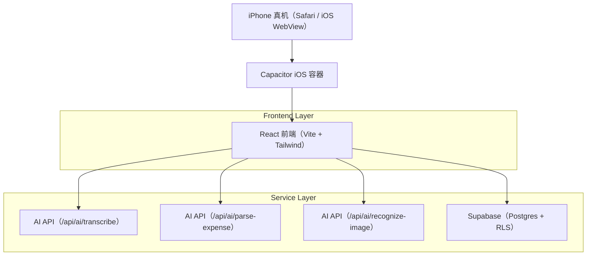
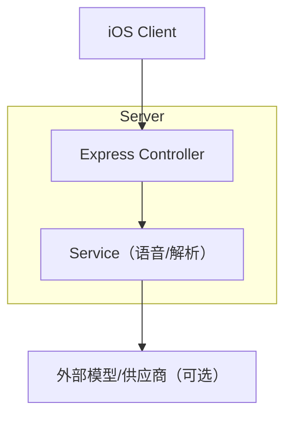
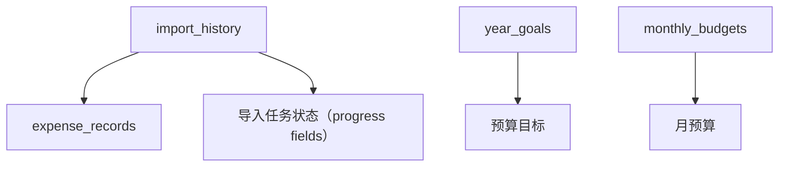

## 1.Architecture design


## 2.Technology Description
- Frontend: React@18 + react-router-dom@7 + tailwindcss@3 + vite@6
- Mobile Container: Capacitor@8（iOS）
- Backend: Express@4（仅用于 AI 相关 API，供真机访问；不要使用 localhost 直连）
- Database: Supabase（PostgreSQL）

## 3.Route definitions
| Route | Purpose |
|---|---|
| /voice | 语音记账（录音、语音识别、识别文本展示） |
| /settings | 数据导入、导入记录、数据清除操作 |
| /history | 历史记录（用于验证删除/清空是否生效） |
| /budget-config | 预算目标（用于验证“清空所有数据”是否生效） |

## 4.API definitions (If it includes backend services)
### 4.1 Core API
语音转文字（Speech-to-Text）
```
POST /api/ai/transcribe
```
Request:
| Param Name| Param Type | isRequired | Description |
|---|---:|---:|---|
| audioBase64 | string | true | 音频 base64 |
| mimeType | string | true | 例如 audio/wav |
| fileName | string | false | 文件名 |
| language | string | false | zh |

Response:
| Param Name| Param Type | Description |
|---|---|---|
| success | boolean | 是否成功 |
| text | string | 识别文本 |
| error | string | 失败原因 |

导入进度（建议：可选增强，便于真机可见）
```
GET /api/import/:importId/status
```

图片识别（OCR/Vision 代理）
```
POST /api/ai/recognize-image
```
Request:
| Param Name| Param Type | isRequired | Description |
|---|---:|---:|---|
| imageBase64 | string | true | 图片 base64（不含 data: 前缀也可） |
| mimeType | string | false | 例如 image/jpeg |

Response:
| Param Name| Param Type | Description |
|---|---|---|
| success | boolean | 是否成功 |
| text | string | 识别出的文本 |
| error | string | 失败原因 |

## 5.Server architecture diagram (If it includes backend services)


## 6.Data model(if applicable)
### 6.1 Data model definition


### 6.2 Data Definition Language
> 目的：让“导入进度/成功失败反馈”在真机也可追溯；让“一键清空所有数据”与文案一致。

Import History 表（import_history）建议新增字段（如当前 schema 尚无）：
```
ALTER TABLE import_history
  ADD COLUMN IF NOT EXISTS status text DEFAULT 'done',
  ADD COLUMN IF NOT EXISTS total_rows integer DEFAULT 0,
  ADD COLUMN IF NOT EXISTS processed_rows integer DEFAULT 0,
  ADD COLUMN IF NOT EXISTS success_rows integer DEFAULT 0,
  ADD COLUMN IF NOT EXISTS failed_rows integer DEFAULT 0,
  ADD COLUMN IF NOT EXISTS skipped_rows integer DEFAULT 0,
  ADD COLUMN IF NOT EXISTS error_sample jsonb;
```

“清空所有数据（Clear All）”至少需要清空：expense_records、year_goals、monthly_budgets、import_history（与你在设置页二次确认文案一致）。

RLS/权限（Supabase guideline，早期可用最小权限）：
```
GRANT SELECT ON import_history TO anon;
GRANT ALL PRIVILEGES ON import_history TO authenticated;
```

关键修复点（对应真机问题）：
- iOS 端出现 “Load failed” 多见于 baseUrl 误用 localhost：前端需要把错误归因到“无法连接服务地址”，并展示当前 baseUrl；同时提供 Retry。
- 图片识别失败常见原因：图片过大/网络中断/跨域或 ATS 限制/服务端超时；需在前端增加压缩或尺寸限制、上传阶段日志、明确提示与 Retry。
- 导入进度：Web/Supabase 模式导入是前端循环写入，需在前端按批次（batch）更新 UI 进度，并可选写回 import_history 进度字段，保证刷新后仍可见。
- 数据清除：clearAllData 必须覆盖 import_history；deleteImportRecord 必须按 import_id 清除对应 expense_records。

命名与包体（Branding）：
- iOS：CFBundleDisplayName 使用中文“咻记”；App 内标题/关于页显示英文 SwoopKeep 与中文咻记（按设计文档统一）。
- GitHub Actions：可继续产出未签名 IPA（用于 sideload）；命名变更不会影响 sideload 机制，但会影响主屏显示。
