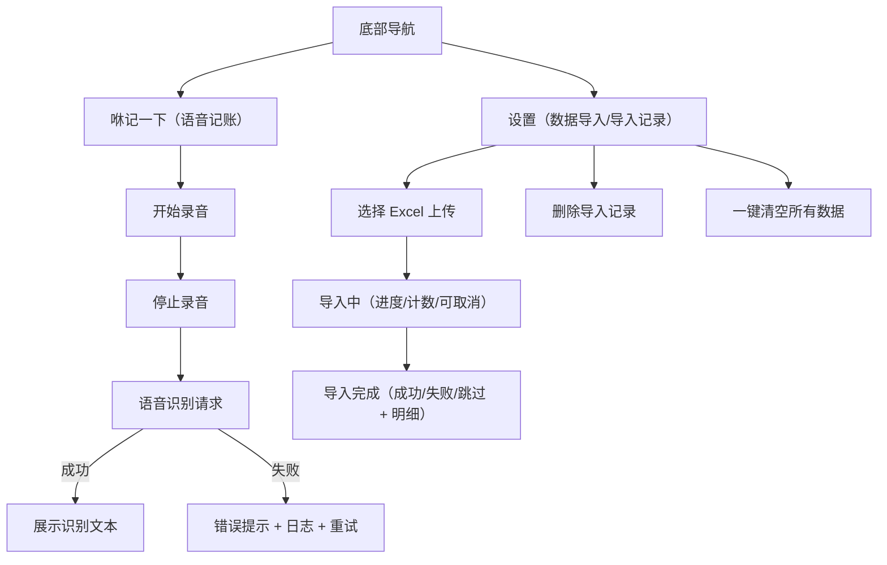

## 1. Product Overview
针对 iPhone 12 Pro Max 真机暴露的问题，完成 UI 安全区适配、语音识别失败的日志与重试、图片识别上传失败修复、历史数据导入的进度/结果反馈、以及数据清除范围不一致的逻辑修复。同时完成 App 命名调整（SwoopKeep / 中文名：咻记）。
目标：真机体验一致、错误可定位（log）、失败可自助恢复（retry）。

## 2. Core Features

### 2.2 Feature Module
本次修复涉及以下核心页面：
1. **咻记一下（语音记账）**：iPhone 12 Pro Max UI 适配；语音识别失败提示、日志展示与重试。
2. **咻记一下（语音记账）**：图片识别上传失败的错误提示、日志与重试。
3. **设置（数据导入/导入记录）**：历史数据导入进度展示、成功/失败反馈；数据清除逻辑一致性修复。
4. **全局**：App 名称与显示名称调整。

### 2.3 Page Details
| Page Name | Module Name | Feature description |
|---|---|---|
| 咻记一下（语音记账） | iPhone UI 适配（Safe Area/安全区） | 适配顶部安全区（Safe Area Top），避免标题/按钮贴近刘海区域；底部导航不遮挡页面内容。 |
| 咻记一下（语音记账） | 语音识别失败处理（Logs/Retry） | 识别失败时展示明确原因（如“无法连接语音识别服务/超时/权限未授予”）；提供“重试”按钮（Retry）与“查看日志”入口（Logs）；日志至少包含：时间戳、请求阶段（录音/上传/返回）、服务地址、错误码/错误信息。 |
| 咻记一下（语音记账） | 图片识别上传失败处理（Logs/Retry） | 上传小票/拍照识别失败时：展示可理解的中文错误提示；提供“重试”与“查看日志”；日志至少包含：时间戳、阶段（选图/压缩/上传/返回）、服务地址、请求体大小（不含图片内容）、错误码/错误信息。 |
| 设置（数据导入/导入记录） | 历史数据导入进度与结果反馈 | 导入中显示进度条与计数（已处理/总行数、成功/失败/跳过）；导入完成展示汇总结果与失败明细（前 5 条行号+原因）；导入失败时展示可操作建议（检查网络/服务地址/文件格式）。 |
| 设置（数据导入/导入记录） | 数据清除逻辑修复（Delete/Clear） | “删除导入记录”必须同时清除该次导入产生的账单数据（按 import_id 关联）；“一键清空所有数据”清除范围与弹窗文案一致（至少包含：账单、预算目标、月预算、导入记录）；完成后页面状态刷新且有明确反馈。 |
| 全局 | App 命名（Branding） | App 英文名：SwoopKeep；中文显示名：“咻记”。iOS 主屏图标显示中文名；应用内标题与设置页显示英文名/中文名一致（按设计说明执行）。 |

## 3. Core Process
### 3.1 用户操作流程（自然语言）
- 语音记账流程：你在“咻记一下”点击麦克风开始录音 → 点击停止 → 发起语音识别 → 成功则展示“识别文本”；失败则展示错误原因，并允许你查看日志与一键重试。
- 数据导入流程：你在“设置-数据导入”选择 Excel 上传 → 进入导入中状态（进度条+计数）→ 完成后弹出汇总结果（成功/失败/跳过）并在“导入记录”中可追溯。
- 数据清除流程：你在“导入记录”删除某条记录 → 清除对应导入产生的账单并移除该导入记录；或选择“一键清空所有数据” → 二次确认后清空并刷新页面。

## 4. 验收标准（Acceptance Criteria）
### 4.1 iPhone 12 Pro Max UI 适配
1. iPhone 12 Pro Max（真机）在 /voice、/settings 页面：顶部内容不与状态栏/刘海重叠；首屏标题与顶部边缘间距一致（可通过 Safe Area Top 实现）。
2. 底部 TabBar 不遮挡页面主要内容（如按钮/表格最后一行）；向下滚动时仍可完整点击底部内容。

### 4.2 语音识别失败与日志/重试
1. 在网络不可用、服务地址不可达、超时、麦克风权限被拒时：页面均显示“可理解的中文错误提示”，不出现仅有“Load failed”等不可解释信息。
2. 失败后提供“重试（Retry）”且不需要重启 App；重试成功后错误提示消失并正常展示识别文本。
3. “查看日志（Logs）”可打开日志面板：至少包含时间戳、阶段、服务地址（脱敏或可见 baseUrl）、错误信息；复制/截图可用于排查。

### 4.2.1 图片识别上传失败与日志/重试
1. 上传小票/拍照识别在网络不可用、服务地址不可达、超时、相机/相册权限被拒时：页面均显示“可理解的中文错误提示”，不出现仅有“Load failed”等不可解释信息。
2. 失败后提供“重试（Retry）”且不需要重启 App；重试成功后错误提示消失并进入解析结果展示。
3. “查看日志（Logs）”可打开日志面板：至少包含时间戳、阶段、服务地址（baseUrl）、图片大小（字节数）、错误信息；日志不得包含图片原始内容与任何密钥。

### 4.3 历史数据导入进度与成功失败反馈
1. 上传 Excel 后，2 秒内进入“导入中”状态并可见进度条与计数：已处理/总行数、成功/失败/跳过。
2. 导入完成后，必须展示汇总结果（成功/失败/跳过），并展示失败明细（前 5 条：行号+原因）。
3. 导入完成后，“导入记录”列表出现本次记录且可删除；删除后对应导入数据不再出现在历史记录/统计中。

### 4.4 数据清除逻辑修复
1. 点击“删除导入记录”后：仅删除该导入对应的账单数据与导入记录，不影响其他手动录入或其他导入批次数据。
2. 点击“一键清空所有数据”后：账单、预算目标、月预算、导入记录全部清空；重新进入各页面数据为空且无残留。
3. 两类清除操作均必须有二次确认弹窗（Confirm），并在成功/失败时给予明确反馈。

### 4.5 App 命名（Branding）
1. iOS 主屏图标下方显示名称为“咻记”。
2. 应用安装后的系统设置页（App 列表）显示名称为“咻记”。
3. 应用内关于/设置页等展示英文名为 “SwoopKeep”（若页面设计要求中文，则按设计说明统一）。
