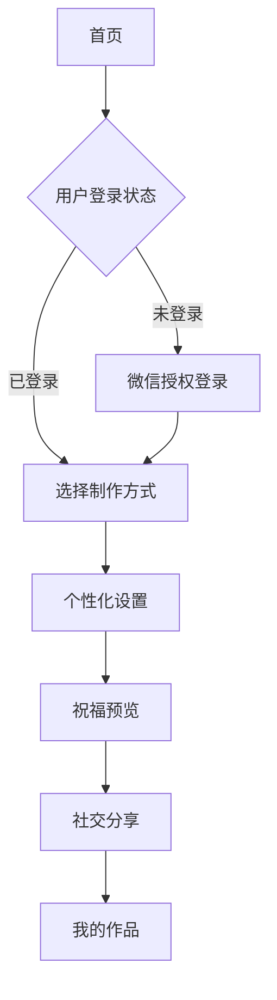

## 1. 产品概述

春节祝福小程序是一款基于微信生态的社交化节日祝福应用，用户可通过AI技术生成个性化Q版形象和语音祝福，结合丰富的动画效果，为亲朋好友送上独特的春节祝福。

产品主要解决传统文字祝福缺乏个性化和趣味性的问题，面向广大微信用户群体，通过AI形象生成、语音克隆等技术提供创新的节日祝福体验。

## 2. 核心功能

### 2.1 用户角色

| 角色   | 注册方式   | 核心权限        |
| ---- | ------ | ----------- |
| 普通用户 | 微信一键登录 | 基础祝福制作、分享功能 |
| 游客用户 | 无需注册   | 浏览模板、限制部分功能 |

### 2.2 功能模块

小程序主要包含以下页面：

1. **首页**：动画展示、祝福模板选择、快速制作入口
2. **个性化设置页**：照片上传、Q版生成、语音录制、文案编辑
3. **祝福预览页**：动画效果展示、背景音乐控制、分享功能
4. **我的作品页**：历史作品管理、再次分享、删除操作

### 2.3 页面详情

| 页面名称   | 模块名称 | 功能描述                        |
| ------ | ---- | --------------------------- |
| 首页     | 动画背景 | 展示烟花粒子动画、生肖马环绕动画、用户个人Q版形象动画 |
| 首页     | 祝福模板 | 显示5种预设祝福模板，支持预览和选择          |
| 首页     | 快速制作 | 提供一键开始制作入口，未登录用户跳转登录        |
| 个性化设置页 | 照片上传 | 支持相册选择和拍照上传，实时预览和裁剪         |
| 个性化设置页 | Q版生成 | AI图像处理生成Q版头像，提供3种风格选择       |
| 个性化设置页 | 语音录制 | 录音功能、试听、重录，语音特征提取           |
| 个性化设置页 | 文案编辑 | 预设模板选择、自定义文本输入（200字限制）      |
| 祝福预览页  | 动画合成 | 整合Q版形象、烟花动画、生肖马动画           |
| 祝福预览页  | 音频控制 | 背景音乐播放/暂停、语音祝福播放            |
| 祝福预览页  | 分享功能 | 微信好友分享、朋友圈分享、自定义分享卡片        |
| 我的作品页  | 作品列表 | 网格展示历史作品，支持预览和管理            |

## 3. 核心流程

用户首次使用流程：进入首页 → 微信授权登录 → 选择祝福模板 → 上传照片生成Q版形象 → 录制语音祝福 → 编辑文案 → 预览动画效果 → 分享祝福

已登录用户流程：进入首页 → 选择制作方式（快速制作/自定义制作）→ 个性化设置 → 预览效果 → 分享祝福

## 4. 用户界面设计

### 4.1 设计风格

* **主色调**：中国红 (#DC143C) 配金色 (#FFD700)

* **辅助色**：深红 (#8B0000)、暖金 (#FFA500)

* **按钮样式**：圆角矩形，渐变背景，悬浮动画效果

* **字体**：中文使用思源黑体，英文使用Roboto

* **布局风格**：卡片式布局，上下分栏结构

* **图标风格**：线性图标，春节元素（灯笼、鞭炮、福字等）

### 4.2 页面设计概述

| 页面名称   | 模块名称   | UI元素                         |
| ------ | ------ | ---------------------------- |
| 首页     | 动画背景   | 全屏烟花粒子效果，生肖马沿圆形路径运动，Q版形象居中展示 |
| 首页     | 祝福模板   | 横向滑动的卡片式设计，每张卡片包含预览图和标题      |
| 个性化设置页 | 照片上传   | 圆形头像框，实时预览区域，底部操作按钮          |
| 个性化设置页 | Q版风格选择 | 3个预览卡片，点击选中效果，实时预览           |
| 祝福预览页  | 动画合成   | 全屏播放，底部控制栏，右上角分享按钮           |

### 4.3 响应式设计

基于微信小程序原生适配，采用rpx单位确保在不同尺寸设备上的显示效果。重点优化iPhone和主流Android机型的显示体验。

### 4.4 动画场景指导

* **烟花动画**：使用Canvas绘制粒子系统，颜色渐变从中心向外扩散

* **生肖马动画**：沿贝塞尔曲线路径运动，添加阴影和发光效果

* **Q版形象**：支持眨眼、微笑等微表情动画，增强生动性

* **转场动画**：页面切换使用淡入淡出效果，时长控制在300ms内

