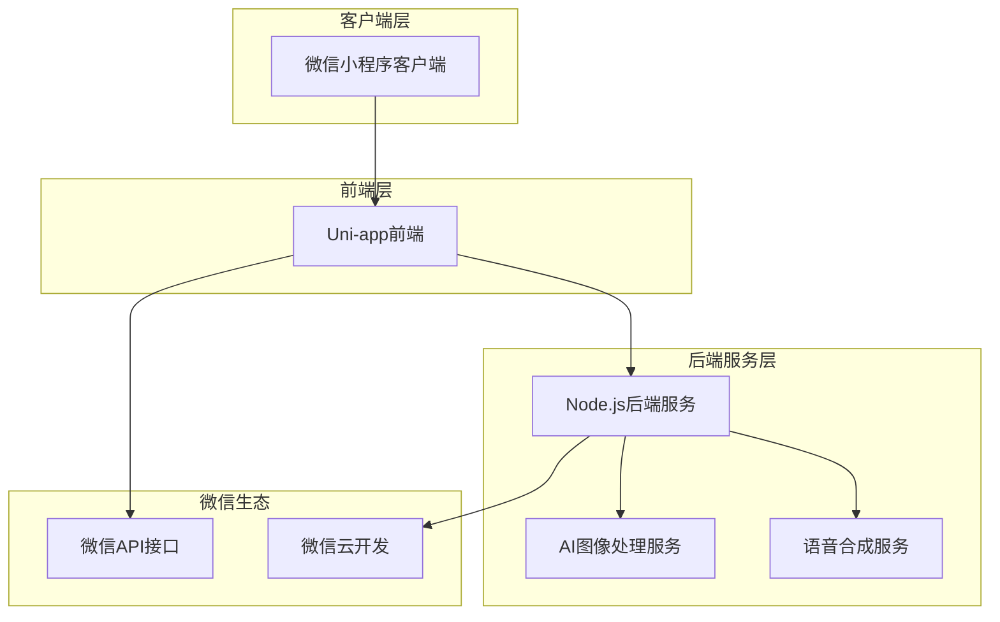
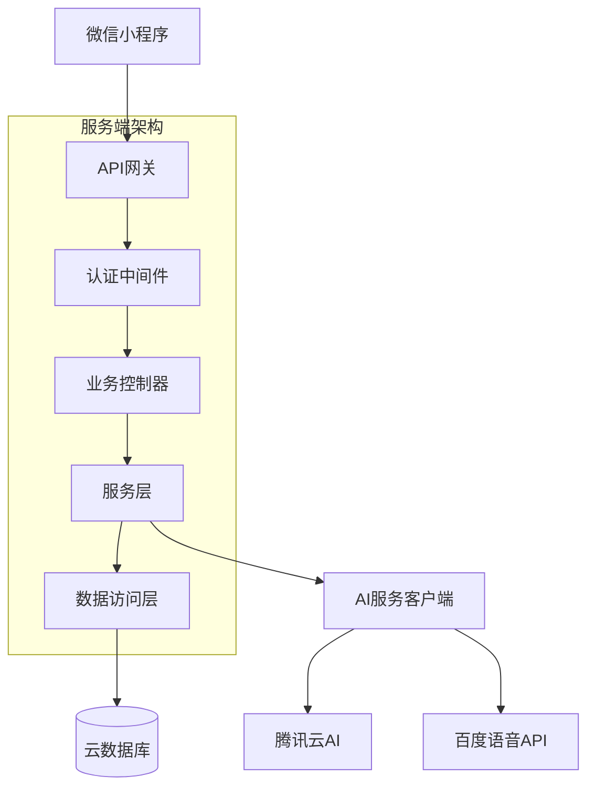
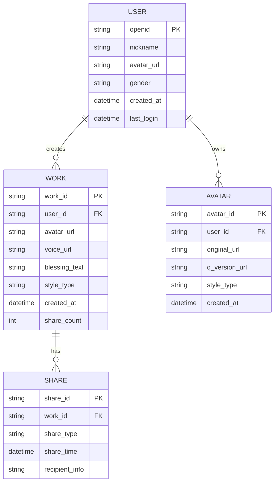

## 1. 架构设计



## 2. 技术描述

- **前端框架**: Uni-app (Vue3) + TypeScript
- **初始化工具**: HBuilderX
- **后端服务**: Node.js + Express + TypeScript
- **数据库**: 微信云开发数据库 (CloudBase)
- **文件存储**: 微信云存储 (CloudStorage)
- **AI服务**: 腾讯云AI图像处理 + 百度语音合成API

## 3. 路由定义

| 页面路径 | 用途 |
|----------|------|
| /pages/index | 首页，展示动画和模板选择 |
| /pages/profile | 个性化设置页面 |
| /pages/preview | 祝福预览页面 |
| /pages/works | 我的作品列表页面 |
| /pages/login | 微信授权登录页面 |

## 4. API定义

### 4.1 用户认证相关
```
POST /api/auth/wechat-login
```

请求参数：
| 参数名 | 类型 | 必填 | 描述 |
|--------|------|------|------|
| code | string | 是 | 微信登录code |
| userInfo | object | 是 | 用户信息对象 |

响应参数：
| 参数名 | 类型 | 描述 |
|--------|------|------|
| token | string | 用户认证token |
| userId | string | 用户唯一标识 |
| expiresIn | number | token有效期 |

### 4.2 Q版头像生成
```
POST /api/avatar/generate
```

请求参数：
| 参数名 | 类型 | 必填 | 描述 |
|--------|------|------|------|
| imageBase64 | string | 是 | 原始图片base64编码 |
| style | string | 是 | Q版风格类型 |

响应参数：
| 参数名 | 类型 | 描述 |
|--------|------|------|
| avatarUrl | string | 生成的Q版头像URL |
| styleId | string | 风格标识符 |

### 4.3 语音合成
```
POST /api/voice/synthesize
```

请求参数：
| 参数名 | 类型 | 必填 | 描述 |
|--------|------|------|------|
| text | string | 是 | 祝福文本内容 |
| voiceId | string | 是 | 语音模型ID |

响应参数：
| 参数名 | 类型 | 描述 |
|--------|------|------|
| audioUrl | string | 合成音频文件URL |
| duration | number | 音频时长（秒） |

## 5. 服务器架构图



## 6. 数据模型

### 6.1 数据模型定义


### 6.2 数据定义语言

用户表 (users)
```sql
-- 创建用户表
CREATE TABLE users (
    openid VARCHAR(100) PRIMARY KEY,
    nickname VARCHAR(100) NOT NULL,
    avatar_url VARCHAR(500),
    gender TINYINT DEFAULT 0,
    created_at TIMESTAMP DEFAULT CURRENT_TIMESTAMP,
    last_login TIMESTAMP DEFAULT CURRENT_TIMESTAMP,
    INDEX idx_last_login (last_login)
);
```

作品表 (works)
```sql
-- 创建作品表
CREATE TABLE works (
    work_id VARCHAR(50) PRIMARY KEY,
    user_id VARCHAR(100) NOT NULL,
    avatar_url VARCHAR(500) NOT NULL,
    voice_url VARCHAR(500),
    blessing_text TEXT,
    style_type VARCHAR(20) NOT NULL,
    created_at TIMESTAMP DEFAULT CURRENT_TIMESTAMP,
    share_count INT DEFAULT 0,
    INDEX idx_user_id (user_id),
    INDEX idx_created_at (created_at DESC)
);
```

头像表 (avatars)
```sql
-- 创建头像表
CREATE TABLE avatars (
    avatar_id VARCHAR(50) PRIMARY KEY,
    user_id VARCHAR(100) NOT NULL,
    original_url VARCHAR(500) NOT NULL,
    q_version_url VARCHAR(500) NOT NULL,
    style_type VARCHAR(20) NOT NULL,
    created_at TIMESTAMP DEFAULT CURRENT_TIMESTAMP,
    INDEX idx_user_id (user_id)
);
```

分享记录表 (shares)
```sql
-- 创建分享记录表
CREATE TABLE shares (
    share_id VARCHAR(50) PRIMARY KEY,
    work_id VARCHAR(50) NOT NULL,
    share_type VARCHAR(20) NOT NULL,
    share_time TIMESTAMP DEFAULT CURRENT_TIMESTAMP,
    recipient_info VARCHAR(200),
    INDEX idx_work_id (work_id),
    INDEX idx_share_time (share_time)
);
```